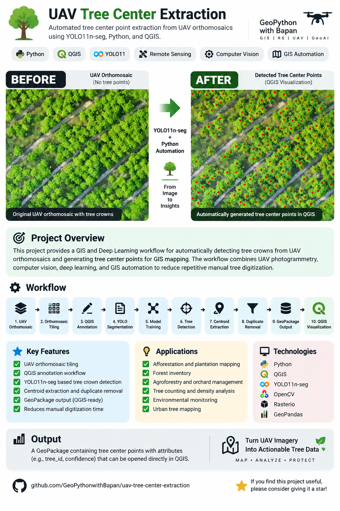

# 🌳 UAV Tree Center Extraction

> Automated tree crown detection and GIS-ready tree center point extraction from UAV orthomosaics using YOLO11n-seg, Python, and QGIS.

<p align="center">
  
</p>

---

## 🎯 Project Overview

This project presents an automated GIS and Deep Learning workflow for detecting tree crowns from UAV orthomosaics and generating corresponding tree center points for GIS mapping.

The workflow combines UAV photogrammetry, computer vision, deep learning, and GIS automation to reduce repetitive manual tree point digitization.

The main objective is to generate GIS-ready tree center points from high-resolution UAV imagery.

---

## 🔄 Before → After

### Before

UAV orthomosaic containing tree crowns without automatically generated tree center points.

### After

Automatically detected tree crowns are converted into GIS point features representing the estimated center of each detected tree crown.

The final result can be visualized and further analyzed in QGIS.

---

## ⚙️ Workflow

```text
UAV Orthomosaic
       ↓
Orthomosaic Tiling
       ↓
QGIS Tree Crown Annotation
       ↓
QGIS → YOLO Segmentation Labels
       ↓
YOLO11n-seg Model Training
       ↓
Full-Area Tree Detection
       ↓
Tree Crown Segmentation
       ↓
Centroid Extraction
       ↓
Duplicate Detection Removal
       ↓
GeoPackage Generation
       ↓
QGIS Visualization'''

---
✨ Key Features
UAV orthomosaic tiling with overlap
Preservation of GeoTIFF CRS and spatial transform
QGIS-based tree crown annotation
Conversion of QGIS polygons to YOLO segmentation labels
YOLO11n-seg based tree crown detection
Full-area tiled inference
Tree crown centroid extraction
Duplicate detection removal
GeoPackage output
QGIS-ready GIS data
Python-based automation
